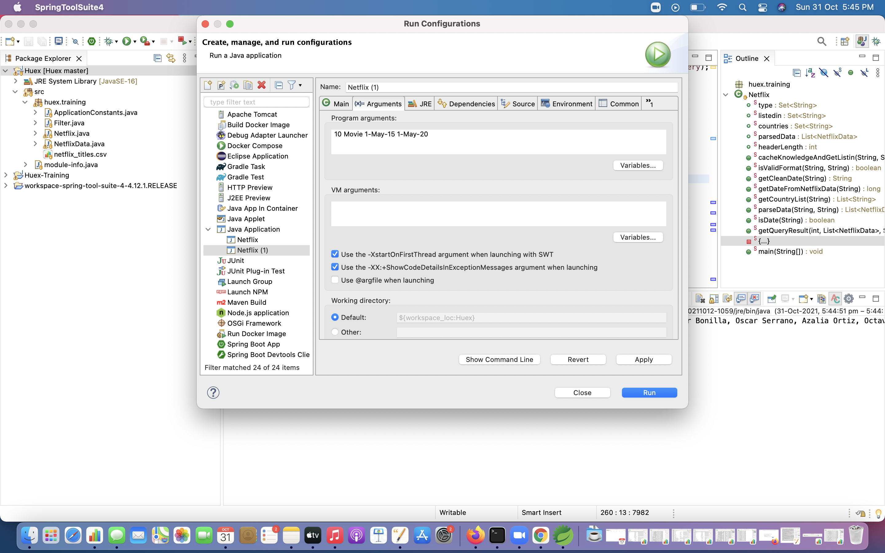
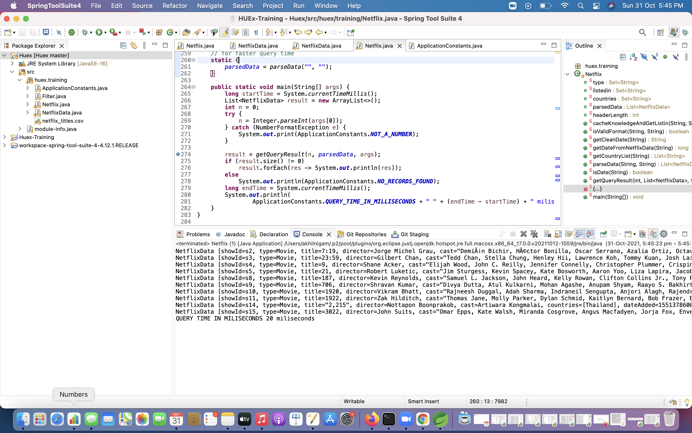

# HuexTraining
Mini project 
Execution Steps are as follows:        
  -Step 1 : Give the proper Netflix_titles.xlsx <b>file path </b>in Netflix.java class based on your file location  
  -Step 2: Give the command line arguments.  
  -Step 3: Run the Netflix.java class.
  
 Result Images are as follows:  
 
 Command Line Arguments
 
  
 <b>Final OUTPUT</b>   
 
